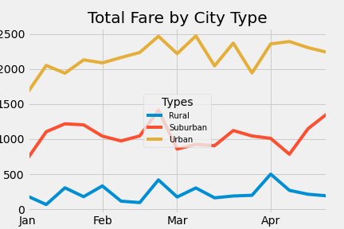
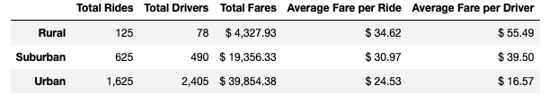

# PyBer_Analysis

## Overview
The purpose of this analysis is to identify how much revenue was made from rides facilited through Pyber, a hypothetical ride hailing company, using data provided between Jan 1 and April 29. I used a breakdown of city type to offer the audience composed of senior managment with a month by month trend analysis to help them locate prospective opportunities for business growth. Herein I use the month by month analysis to offer recommendations informed by the the month and town type. To conduct this analysis I used .csv files provided to me by my hypothetical employer and python/juptyer notebook.

## Results
The broadest conclusion of this analysis is that the three town types bring in the most fare/revenue in the following order:
 1. Urban
 2. Suburban
 3. Rural
 
 To see a breakdown in how these town types perform over the course of January 1st 2019 and April 29th 2019, please refer to the table below.
 
### Pyber Fare Summary by City Type

As one can see, the three town types perform distinctly different from one another, never intersecting in terms of how much in fares they are able to command. Each city type also sees spikes and drops in fares, not entirely exclusive to each type. For example, see February to pre-march.

To see some of the summary statistics of each town type, please see the below.

### Pyber General Summary Statistics

Similarly to what we see in the graph, urban town types bring in the most in Total Fares and has the most activity in terms of Total Rides. However, the Average Fare per Ride and Average Fare per Driver are higher in Rural and Suburban towns.

## Summary
